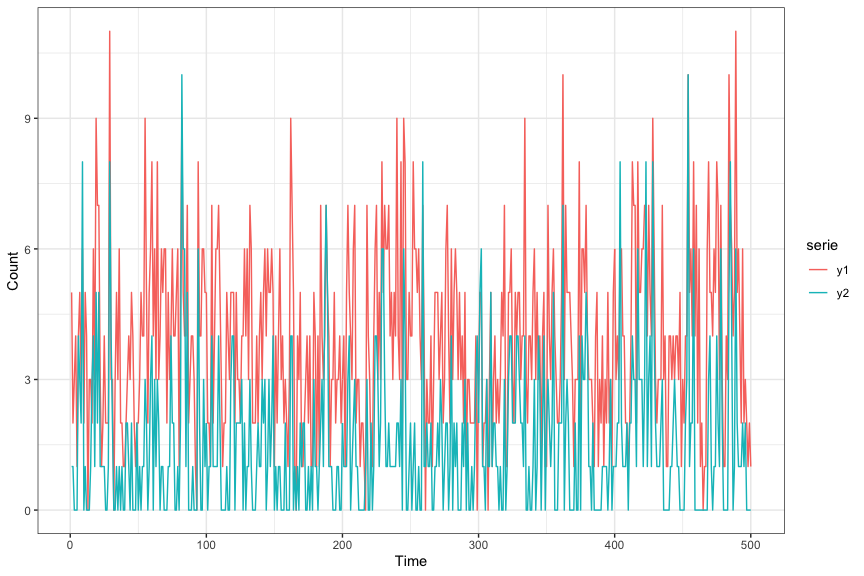

Luiza Piancastelli <luiza.piancastelli@ucdconnect.ie>

`rbcpingarch` is an R package providing code to simulate and fit the
Bivariate Conditional Poisson INGARCH(1,1) process proposed in
[Piancastelli, Barreto-Souza and
Ombao](https://arxiv.org/abs/2011.08799). Our package links to `rstan`,
so proper setup of C++ compiler is required for usage. Once this is
done, installation from GitHub is as follows.

``` r
# install.packages("devtools")
devtools::install_github("luizapiancastelli/rbcpingarch")
```

### BCP-INGARCH simulation

The next chunk of code exemplifies the usage of `rBCPINGARCH` for
simulating a realisation of the bivariate conditional Poisson count
process. A simplified description of the function arguments is included
in the call of `help(rBCPINGARCH)`.

``` r
A = diag(c(0.3, 0.1)) #Diagonal (2x2) matrix
B = diag(c(0.2, 0.3)) #Diagonal (2x2) matrix, can be non diagonal as long as stationarity conditions satisfied
omega = c(2,1) 
phi = 0.3 
n = 500  #Time series length

Y = rBCPINGARCH(A, B, omega, phi, n)
head(Y)
#>      [,1] [,2]
#> [1,]    0    1
#> [2,]    1    0
#> [3,]    4    1
#> [4,]    2    2
#> [5,]    3    0
#> [6,]    2    0
cor(Y)
#>           [,1]      [,2]
#> [1,] 1.0000000 0.5855228
#> [2,] 0.5855228 1.0000000

Y_df = data.frame('y1' =Y[,1], 'y2' = Y[,2], 't' = 1:nrow(Y))
Y_df = pivot_longer(Y_df, cols = starts_with('y'), names_to = 'serie', values_to = 'count')

ggplot(Y_df, aes(x = t, y = count, color = serie))+
  geom_line()+theme_bw()+
  labs(y = 'Count', x = 'Time')
```



### Model fit

In what follows, the function `fit_BCP_INGARCH` is used for conditional
maximum likelihood estimation of the model parameters for the bivariate
count time series data of viral hepatites cases in the Brazilian cities
Goiania and Brasilia. This data set is available in `rbcpingarch` via a
call to `data("Y_hep")`, originally collected from the [DATASUS
platform](https://datasus.saude.gov.br). This function takes as
arguments the observed data and specification of `A` and `B` matrices as
diagonal or non-diagonal, which relates to the between series INGARCH
parameters.

``` r
data("Y_hep") #Loads the Brazilian hepatites count data set

fit_diag = fit_BCP_INGARCH(Y_hep, A.diag = TRUE, B.diag = TRUE) 
fit_diag$par #maximised parameter values
#>        A[1]        A[2]        B[1]        B[2]  omega[1,1]  omega[2,1] 
#> 0.465619498 0.481809019 0.429948649 0.383853540 2.310480454 6.518914405 
#>         phi 
#> 0.009613826
fit_diag$se  #asymptotic standard errors
#>         A11         A22         B11         B22      omega1      omega2 
#> 0.056709886 0.039787482 0.042086278 0.026293151 0.578115241 0.909545488 
#>         phi 
#> 0.001149342
fit_diag$loglik 
#> [1] 46115.42

fit_nd = fit_BCP_INGARCH(Y_hep, A.diag = TRUE, B.diag = FALSE)
fit_nd$par
#>        A[1]        A[2]      B[1,1]      B[2,1]      B[1,2]      B[2,2] 
#> 0.496876989 0.447653650 0.398157521 0.018631135 0.001979496 0.399368538 
#>  omega[1,1]  omega[2,1]         phi 
#> 2.216294309 7.011972425 0.009599605
fit_nd$se
#>         A11         A22         B11         B21         B12         B22 
#> 0.059010457 0.043599866 0.046492743 0.031799857 0.007077866 0.029602968 
#>      omega1      omega2         phi 
#> 0.612004557 1.133671734 0.001154630
fit_nd$loglik
#> [1] 46117.22
```
